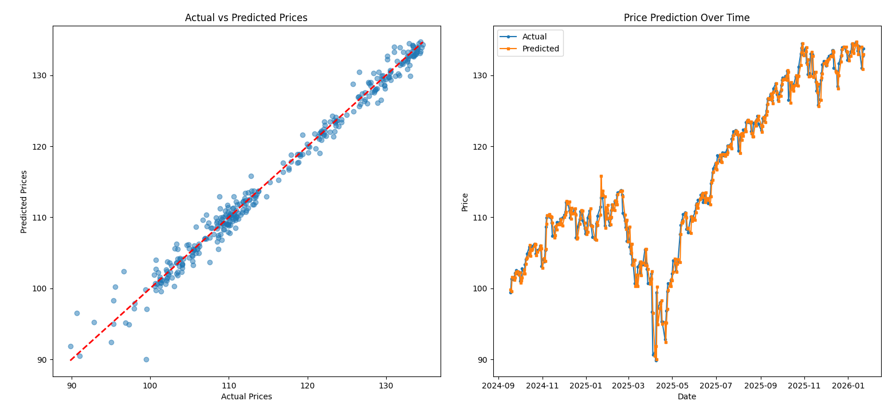

# Market Prediction Regression AI model

## Overview
A linear regression-based machine learning tool that predicts future stock closing prices using historical data and technical indicators.

## Key Features
*   **Data Source:** Fetches historical data via Yahoo Finance.
*   **Feature Engineering:** Generates 20+ features including:
    *   Simple Moving Averages (5, 10, 20 days)
    *   RSI (Relative Strength Index)
    *   Bollinger Bands
    *   Lagged Price/Volume data
*   **Visualization:** Automatically plots Actual vs Predicted prices.


## Logic
The model provides recommendations based on the predicted % change:
- **BUY:** > +2%
- **SELL:** < -2%
- **HOLD:** Within ±2%

Training process divides chosen time period into training data - 80% and testing data - 20%.
Accuracy of the model is evaluated using mean squared error, mean absolute error and R-squared score.

## Usage
Run the script and enter a ticker symbol:
```bash
pip install -r requirements.txt
python model.py
# Enter symbol: AAPL
```
